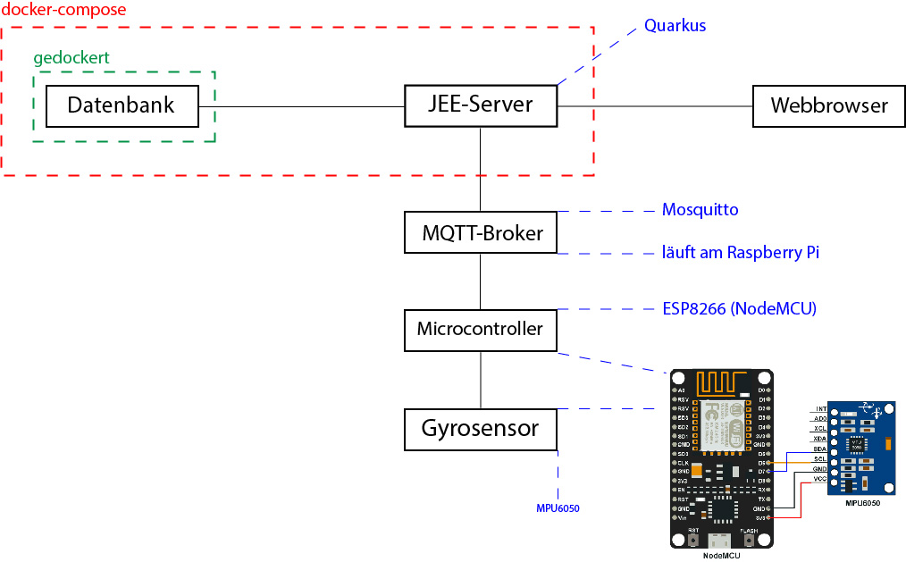

= Pflichtenheft

// Metadata
Von Nina Holzinger, David Andraschko und Konstantin Frank <frank.konstantin01@gmail.at>
1.0, 14-01-2020: Projekt Netunus (Pool Guard)

// Settings
:source-highlighter: coderay
:icons: font
//:sectnums:    // Nummerierung der Überschriften / section numbering
// Refs:
//:imagesdir: assets
//:sourcedir-code: src/main/java/at/htl/jdbcprimer
//:sourcedir-test: src/test/java/at/htl/jdbcprimer
:toc:

Version: 1.0 +
Version Date: 14.1.2020 +
Version Notes: Projekt Netunus (Pool Guard) +
Author: Konstantin Frank frank.konstantin01@gmail.com

++++
<link rel="stylesheet"  href="http://cdnjs.cloudflare.com/ajax/libs/font-awesome/4.7.0/css/font-awesome.min.css">
++++

== 1. Ausgangssituation
Im Jahr 2018 wurden etwas mehr als 85.000 Kinder in Österreich geboren.
Vor allem im Sommer spielen die Kinder, wenn möglich draußen in der Sonne.
In Österreich gibt es immer mehr Haushalte mit einem Swimming-Pool im Garten.
Laut der letzten Auswertung des Landes Oberösterreich gibt es in etwa 61.000 Pools in Oberösterreich,
jedoch kann aktuell mit einer höheren Zahl gerechnet werden da die Zahl stetig steigt.
Viele Familien genießen ihre heißen Sommertage gemeinsam am Pool und erfreuen sich an der Abkühlung im Nass.

== 2. Ist-Situation
Die Aufsichtspersonen der spielenden Kinder können jedoch aus verschiedenen Gründen
unaufmerksam sein und die Kinder sich selbst überlassen. Schon öfter ist es vorgekommen,
dass ein Baby bzw. ein Kleinkind unbeaufsichtigt in einen Pool gefallen und ertrunken ist, oder bleibende
Schäden davon getragen hat.
Selbiges kann natürlich auch Haustieren passieren.
Zur Vermeidung dieser Unfälle gibt es schon verschiedene Lösungsansätze. Zum Beispiel ein Armband, welches bei Kontakt mit Wasser
mit Hilfe eines akustischen Warnsignals auf den Umstand aufmerksam macht. Es kann auch einfach ein
Zaun um den Pool aufgestellt werden.

== 3. Problem
Diese Bänder können jedoch nur dann helfen, wenn sie auch wirklich angelegt sind. Schließlich kann es passieren, dass auf das Armband
vergessen wurde oder ein Kind zu Besuch ist, dass kein solches Band besitzt.

== 4. Aufgabenstellung
Es ist ein System zu entwickeln mit deren Hilfe eine solche Tragödie vermieden werden kann.
Angenommen ein Kleinkind fällt unbeaufsichtigt in das Wasser so erkennt dieses System, dass Wellen
erzeugt wurden und gibt ein audiovisuelles Warnsignal? von sich um die Aufsichtsperson darauf aufmerksam zu machen,
damit das Kind so schnell wie möglich gerettet werden kann. Dieses System kann je nach belieben auch mit den Bändern kombiniert werden.
Es ist aber keine Integration in das Bänder-System geplant.

Man sollte die Applikation einfach für eine gewisse Zeitdauer deaktivieren können, wenn man
bewusst schwimmen gehen möchte. Nebenbedingungen wie ein Stromausfall, Sensorausfall etc. sollen
ebenso erkannt werden.

Das aktuell geplante System tastet sich vorerst nur an einen Prototypen heran.
Es sollte möglichst ausfallsicher und einfach zu installieren sein.
Wünschenswert wäre, wenn die Stromzufuhr möglichst nachhaltig wäre, daher wollen wir auf
klassische Batterien verzichten und stattdessen wiederaufladbare Batterien verwenden.
Ein Betrieb durch Solarstrom ist bei diesem geringen Verbrauch auszuschließen, da zu viel Zusatz-Material
benötigt werden würde.

=== 4.1 Anwendungsfälle

image::http://www.plantuml.com/plantuml/proxy?chache=n0&src=https://raw.githubusercontent.com/KonstantinFrank01/safer-pool/master/Assets/use-case-diagram.iuml[]

<<<

=== 4.2 Systemarchitektur

== 5. Ziele
Das klare Ziel dieser Anwendung ist es Kinder vor dem Ertrinken zu schützen.
Wie schon erwähnt soll das System möglichst nachhaltig betrieben werden.
Es ist noch keine Produktreife geplant. Vorerst wird eine Webseite statt einer
MobileApp entwickelt.
