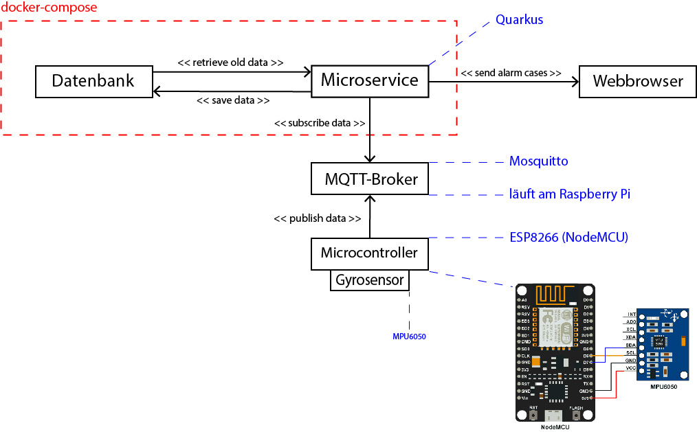

= Pflichtenheft

// Metadata
Von Nina Holzinger, David Andraschko und Konstantin Frank <frank.konstantin01@gmail.at>
1.0, 14-01-2020: Projekt Netunus (Pool Guard)

// Settings
:source-highlighter: coderay
:icons: font
//:sectnums:    // Nummerierung der Überschriften / section numbering
// Refs:
:toc:

Version: 1.0 +
Version Date: 14.1.2020 +
Version Notes: Projekt Netunus (Pool Guard) +
Author: Konstantin Frank frank.konstantin01@gmail.com

++++
<link rel="stylesheet"  href="http://cdnjs.cloudflare.com/ajax/libs/font-awesome/4.7.0/css/font-awesome.min.css">
++++

== 1. Ausgangssituation
Im Jahr 2018 wurden etwas mehr als 85.000 Kinder in Österreich geboren.
Vor allem im Sommer spielen die Kinder, wenn möglich draußen in der Sonne.
In Österreich gibt es immer mehr Haushalte mit einem Swimming-pool im Garten.
Laut der letzten Auswertung des Landes Oberösterreich gibt es in etwa 61.000 Pools in Oberösterreich,
jedoch kann aktuell mit einer höheren Zahl gerechnet werden, da die Zahl stetig steigt.
Viele Familien genießen ihre heißen Sommertage gemeinsam am Pool und erfreuen sich an der Abkühlung im Nass.

== 2. Ist-Situation
Es ist fast unmöglich, Kinder lückenlos zu beaufsichtigen, da einen jeder noch so kleine Umstand ablenken kann.
Beispiele für solche Ablenkungen wären ein Anruf oder auch ein kurzer Gang ins Haus, um etwas zu holen.

== 3. Problem
Auch wenn die Zeit, in der die Kinder unbeaufsichtigt sind, noch so kurz ist, kann es dadurch sehr schnell zu
Badeunfällen kommen.

== 4. Aufgabenstellung
Es ist ein System zu entwickeln, dass Objekte detektiert, die in den Pool fallen. Das müssen in erster Linie nicht nur Kleinkinder, sondern können auch Haustiere oder ein Ball, mit dem das Kind gerade spielt sein. Sobald solch eine Detektion durch das System erfolgt wird sowohl ein auditives wie auch visuelles Signal abgegeben werden.

Die Detektion kann auch für eine gewisse Zeitdauer deaktiviert werden, wen man bewusst schwimmen gehen möchte.
Nebenbedingungen wie ein Stromausfall, Sensorausfall etc. werden ebenso erkannt.

Das aktuell geplante System tastet sich vorerst nur an einen Prototypen heran. Es wird möglichst ausfallsicher und einfach zu installieren sein. Wünschenswert wäre, wenn die Stromzufuhr möglichst nachhaltig wäre, daher wollen wir auf klassische Batterien verzichten und stattdessen wiederaufladbare Batterien verwenden. Ein Betrieb durch Solarstrom ist bei diesem geringen Verbrauch auszuschließen, da man zu viel Zusatz-Material benötigt.

=== 4.1 Funktionale Anforderungen

=== 4.1.1 Anwendungsfälle

image::http://www.plantuml.com/plantuml/proxy?src=https://raw.githubusercontent.com/KonstantinFrank01/safer-pool/master/Assets/use-case-diagram.iuml[sdasdasdasd]

<<<

=== 4.2 Nicht-funktionale Anforderungen

Das System wird leicht zu bedienen und übersichtlich aufgebaut sein. Auch die App wird nur die wichtigsten Funktionen
enthalten um dem User die Bedienung so leicht als möglich zu machen.

Die Alarmierung des Systems wird, je nach Poolgröße, so schnell wie möglich erfolgen um die Personen in der Umgebung
schnellstmöglich zu alarmieren.

Die App zum Produkt wird in mehreren Sprachen verwendbar sein um diese nicht nur in den deutschsprachigen Ländern
benutzen zu können.

Das System muss gewährleisten, dass im Falle eines (bevorstehenden) Ausfalls, man sofort in der Handyapp benachrichtigt,
um diesen so schnell wie möglich beheben zu können. Außerdem werden alle Daten vergangener Alarme jederzeit, nur für den
jeweiligen Nutzer, einsehbar sein.

=== 4.3 Systemarchitektur

== 5. Zielsetzung
Das klare Ziel dieser Anwendung ist es Kinder sowie Haustiere vor Badeunfällen zu bewahren.
Wie schon erwähnt wird das System möglichst nachhaltig betrieben.
Es wird eine App zur noch schnelleren Benachrichtigung und angenehmerer Benutzung des Systems entwickelt.
